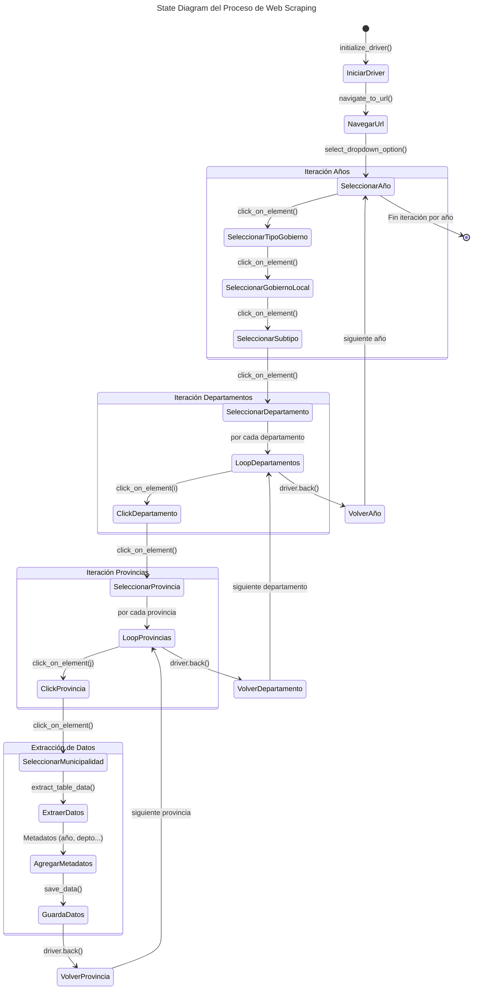

[]( )

# Web Scraping: Consulta Amigable MEF <a id='a'></a>
Este proyecto utiliza Selenium para automatizar la navegación web y extraer datos del portal [Consulta Amigable](https://apps5.mineco.gob.pe/transparencia/Mensual/default.aspx) del MEF. Los datos extraídos se guardan en un archivo XLSX/CSV para su posterior análisis y procesamiento.

El scraper está optimizado para extraer la ejecución del gasto con frecuencia mensual según la desagregación "¿Quién gasta?", iterando por año, departamento, provincia y municipalidad, siendo este último el nivel donde se obtienen los datos.


## Contenido
1. [**Requisitos**](#1)
2. [**Instalación**](#2)
3. [**Estructura del Proyecto**](#3)
4. [**Uso**](#4)


## 1. Requisitos <a id='1'></a>

Este proyecto se desarrolló en:
* Python 3.11
* ChromeDriver

Para ejecutar se necesitas tener instaladas las siguientes dependencias con `pip`:

```cmd
pandas==2.2.3
numpy==2.2.2
openpyxl==3.1.5
selenium==4.28.1
requests==2.32.3
```

## 2. Instalación <a id='2'></a>

### 2.1. Clonar el repositorio
Clona este repositorio en tu máquina local utilizando el siguiente comando:
```bash
git clone https://github.com/AlexEvanan/Web-Scraping-Consulta-Amigable-MEF.git
```

Se establece como directorio de trabajo la carpeta clonada.
```bash
cd "nombre de la carpeta"
```

### 2.2. Crear y activar el entorno virtual

```bash
python -m venv .venvWS
```

```bash
.venvWS\Scripts\activate
```

> [!NOTE]
> Verificar que el terminal muestre el entorno virtual activo.

### 2.3. Instalar las dependencias
```cmd
pip install -r requirements.txt
```

### 2.4 Descargar ChromeDriver
Desde la web oficial  [ChromeDriver](https://googlechromelabs.github.io/chrome-for-testing/#stable) descargar la version estable del binario en formato `.zip`.

Los archivos extraídos del  `.zip` guardar y/o reemplazar en la carpeta `03_config\chromedriver`

> [!IMPORTANT] 
> La versión del Chrome (el navegador regular) debe estar actualizado. 

## 3. Estructura del Proyecto <a id='3'></a>

```
/WS CAMEF/
│
├── 01_data/                # Datos extraídos y procesados
│   ├── raw/                
│   └── processed/          
│
├── 02_src/                 # Código fuente
│   ├── a_config.py         # Configuración url, driver y otros
│   ├── b_scraper.py        # Código relacionado con el scraping web
│   ├── c_cleaner.py        # Código para limpiar y preprocesar los datos
│   └── d_analysis.ipnb     # Scripts de análisis de los datos
│
├── 03_config/              # Driver para simular navegación
│   └── chromedriver/
│       ├── chromedriver.exe
│       ├── LICENSE.chromedriver
│       └── THIRD_PARTY_NOTICES.chromedriver
│           
├── 04_results/             # Resultados y reportes
├── requirements.txt        # Dependencias del proyecto
├── README.md               # Documentación
└── .venvWS/                # Entorno virtual
```

A continuación se describe los códigos fuente ("source") que se encuentran en la carpeta `02_src/`

### 3.1 `a_config.py`
Define rutas, parámetros de ejecución y detalles clave para la navegación en la web y procesamiento de datos. 

* Configuración del WebDriver y Navegación.
    * Define las rutas del proyecto (datos crudos, procesados y WebDriver).
    * Especifica la URL de la plataforma a extraer datos.
* Parámetros de Scraping
    * Lista de años a consultar en la web.
    * Definición de archivos de salida, tanto finales como parciales (para manejar errores).
    * Especificación de los encabezados base que tendrá el dataset extraído.
* Parámetros de Procesamiento
    * Nombre del archivo final procesado, que almacenará los datos estructurados.

> [!NOTE]
> Este script define los parámetros de configuración recurrentes para garantizar coherencia, facilidad de mantenimiento y flexibilidad. Además, separa la configuración de la lógica del código principal.

### 3.2 `b_scraper.py`
Este script es el núcleo del proceso de scraping. Su función principal es automatizar la navegación en el portal de definido, extraer la información relevante y almacenarla en un archivo de salida.

* Carga la configuración desde `a_config.py`.
* Define funciones especializadas.
* Automatiza la navegación.
* Extrae y guarda la información.

El script se compone de las siguientes funciones:

* `initialize_driver()` → Configura y lanza el WebDriver.
* `switch_to_frame()` → Reinicia/cambia el contexto al frame especificado.
* `navigate_to_url()` → Accede a la URL objetivo.
* `click_on_element()` → Hace clic en un elemento de la página.
* `select_dropdown_option()` → Selecciona una opción en un desplegable.
* `extract_table_data()` → Extrae datos de una tabla en la web.
* `get_final_headers()` → Extrae los encabezados de la tabla en la web.
* `extract_data_by_year()` → Realiza la navegación iterativa por cada año y demás niveles definidos.
* `save_data()` → Guarda los datos extraídos.
* `main()` → Función principal que llama a las funciones en el orden correcto para la ejecución del scraper.

En el siguiente diagrama se muestra la lógica desarrollada.


*Elaboración propia.* <br>
***Nota:** Este diagrama muestra el flujo de navegación y extracción de datos, detallando las iteraciones en la automatización. Implícitamente, después de cada `click_on_element()`, se ejecuta `switch_to_frame()`.*  


### 3.3 `c_cleaner.py`
Este script se encarga de la limpieza y preprocesamiento de los datos extraídos.  

- Carga los datos desde el archivo generado por `b_scraper.py`.  
- Aplica transformaciones y limpieza de columnas.  
- Convierte valores numéricos y normaliza la estructura.  
- Guarda los datos procesados en un nuevo archivo de salida.  

El script se compone de las siguientes funciones:  

- **`read_files()`** → Lee archivos Excel o CSV y los carga en un DataFrame.  
- **`split_column()`** → Divide una columna en múltiples columnas según un delimitador.  
- **`numeric_columns()`** → Convierte columnas con valores numéricos eliminando caracteres no válidos.  
- **`save_data()`** → Guarda el DataFrame procesado en un archivo Excel.  
- **`main()`** → Función principal que ejecuta la secuencia de limpieza y almacenamiento de datos.  


## 4. Uso <a id='4'></a>

### 4.1. Activar el entorno virtual

```cmd
.venvWS\Scripts\activate
```

### 4.2. Ejecutar el Script de Scraping
Para ejecutar el scraper y extraer los datos, simplemente corre el siguiente comando:

```cmd
python 02_src\b_scraper.py
```

### 4.3. Ejecutar el Script de Limpieza y Procesamiento

```cmd
python 02_src\c_cleaner.py
```

## Licencia
Este proyecto está licenciado bajo la Licencia MIT. Consulta el archivo LICENSE para más detalles.

## Citación


## Contactos
Correo:
LinkedIn: 

[**Subir ↑**](#a)