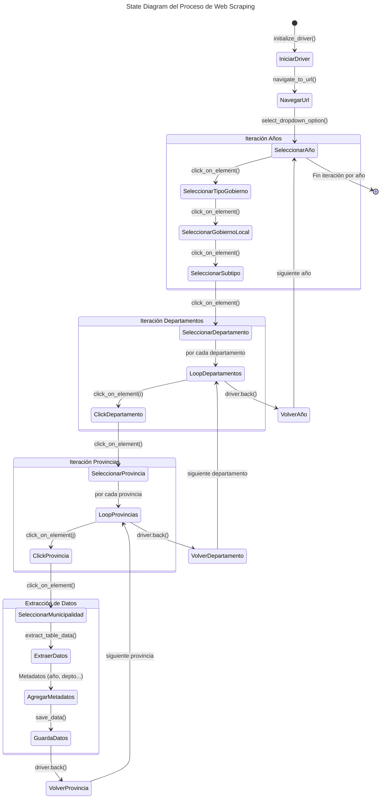

[](https://doi.org/10.5281/zenodo.14876919)

# Web Scraping: Consulta Amigable MEF <a id='a'></a>
Este proyecto, desarrollado en **Python**, emplea **Selenium** para automatizar la navegación y extracción de datos del portal [Consulta Amigable](https://apps5.mineco.gob.pe/transparencia/Mensual/default.aspx) del **Ministerio de Economía y Finanzas (MEF) de Perú**.  

Los datos extraídos corresponden a la **ejecución del gasto público a nivel municipal** según la desagregación **"¿Quién gasta?"**, con una frecuencia **mensual**. El proceso sigue una estructura jerárquica, iterando por **año, departamento, provincia y municipalidad**, siendo este último el nivel donde se obtienen los datos.

Los datos obtenidos son preprocesados y almacenados en formato **XLSX/CSV**. Además, para la gestión del código y control de versiones, se emplearon **Git** y **GitHub**.


## Contenido
1. [**Requisitos**](#1)
2. [**Instalación**](#2)
3. [**Estructura del Proyecto**](#3)
4. [**Uso**](#4)
___


## 1. Requisitos <a id='1'></a>

Este proyecto fue desarrollado con:
* **Python** 3.11
* **ChromeDriver**
* **Git** (recomendado para clonar el repositorio)

Para ejecutar se necesita tener instaladas las siguientes dependencias:

```cmd
pandas==2.2.3
numpy==2.2.2
openpyxl==3.1.5
selenium==4.28.1
requests==2.32.3
```

## 2. Instalación <a id='2'></a>

### 2.1. Clonar el repositorio

> [!IMPORTANT]
> Para clonar el repositorio instalar [Git](https://git-scm.com/downloads/win).
> * [Guía](https://github.com/AlexEvanan/Version-control-guide-Git-GitHub) para la configuración inicial de GIT.
> * [Guía](https://github.com/AlexEvanan/Guide-Install-Python) para instalar Python.

1. Abre una terminal o línea de comandos Git Bash.

2. Ejecuta el siguiente comando para clonar el repositorio en tu máquina local:
```bash
git clone https://github.com/AlexEvanan/Web-Scraping-Consulta-Amigable-MEF.git
```

3. Se establece como directorio de trabajo la carpeta clonada.
```bash
cd Web-Scraping-Consulta-Amigable-MEF
```


### 2.2. Crear y activar el entorno virtual

Se recomienda utilizar un entorno virtual para gestionar las dependencias del proyecto de forma aislada.  

1. Abre una terminal CMD dentro del directorio del proyecto.

2. Ejecuta el siguiente comando para crear el entorno virtual.
```bash
python -m venv .venvWS
```

3. Activar el entorno virtual.
```bash
.venvWS\Scripts\activate
```

> [!NOTE]
> Verificar que el terminal muestre el entorno virtual activo. Ejemplo: `(.venvWS) D:\...`


### 2.3. Instalar las dependencias

En la terminal CMD ejecutar:

```cmd
pip install -r requirements.txt
```


### 2.4. Descargar ChromeDriver

Desde la web oficial  [ChromeDriver](https://googlechromelabs.github.io/chrome-for-testing/#stable) descargar la version estable del `.exe` en formato `.zip`.

Los archivos extraídos del  `.zip` guardar y/o reemplazar en la carpeta `03_config\chromedriver\`

> [!IMPORTANT] 
> La versión del Chrome (el navegador regular) debe estar actualizado. 


## 3. Estructura del Proyecto <a id='3'></a>

```
/WS CAMEF/
│
├── 01_data/                # Datos extraídos y procesados
│   ├── raw/                
│   └── processed/          
│
├── 02_src/                 # Código fuente
│   ├── a_config.py         # Configuración url, driver y otros
│   ├── b_scraper.py        # Código relacionado con el scraping web
│   ├── c_cleaner.py        # Código para limpiar y preprocesar los datos
│   └── d_analysis.ipnb     # Scripts de análisis de los datos
│
├── 03_config/              # Driver para simular navegación
│   └── chromedriver/
│       ├── chromedriver.exe
│       ├── LICENSE.chromedriver
│       └── THIRD_PARTY_NOTICES.chromedriver
│           
├── 04_results/             # Resultados y reportes
├── requirements.txt        # Dependencias del proyecto
├── README.md               # Documentación
└── .venvWS/                # Entorno virtual
```

A continuación se describe los códigos fuente (*source*) que se encuentran en la carpeta `02_src/`


### 3.1. `a_config.py`

Define rutas, parámetros de ejecución, navegación en la web y procesamiento de datos. 

* Configuración del directorio y URL.

| **Variable**        | **Descripción**                           |
|---------------------|-------------------------------------------|
| `PATH_BASE`        | Directorio principal ()                      |
| `PATH_DATA_RAW`    | Ruta donde se almacenan los datos crudos  |
| `PATH_DATA_PRO`    | Ruta donde se guardan los datos preprocesados |
| `PATH_DRIVER`      | Ubicación del WebDriver                   |
| `URL`              | Plataforma de la cual se extraen los datos |

* Parámetros de Scraping y preprocesamiento

| **Variable**             | **Descripción**                                     |
|--------------------------|-----------------------------------------------------|
| `YEARS`                  | Rango de años `list(range(2015, 2026))` (no incluye el limite superior) |
| `ARCHIVO_SALIDA`         | Nombre del archivo generado por el scraping        |
| `ARCHIVO_SALIDA_PARCIAL` | Archivo temporal en caso de error durante scraping |
| `ENCABEZADOS_BASE`       | Nombre de las primeras columnas del dataset        |
| `ARCHIVO_PROCESADO`      | Nombre del archivo después del preprocesamiento    |

> [!NOTE]
> Este script define los parámetros de configuración que pueden ser modificados de acuerdo a las necesidades. El objetivo es separar la configuración de la lógica del código principal.


### 3.2. `b_scraper.py`
Este script es el núcleo del proceso de scraping. Su función principal es automatizar la navegación en el portal definido, extraer los datos y almacenarla en un archivo de salida.

* Carga la configuración desde `a_config.py`.
* Define funciones especializadas.

El script se compone de las siguientes funciones creadas:
| **Función**               | **Descripción**                           |
|---------------------------|-------------------------------------------|
|`initialize_driver()`      | Configura y lanza el WebDriver.|
|`navigate_to_url()`        | Accede a la URL objetivo.|
|`switch_to_frame()`        | Reinicia/cambia el contexto al frame especificado.|
|`click_on_element()`       | Hace clic en un elemento de la página.|
|`select_dropdown_option()` | Selecciona una opción en un desplegable.|
|`extract_table_data()`     | Extrae datos de una tabla en la web.|
|`get_final_headers()`      | Extrae los encabezados de la tabla en la web.|
|`extract_data_by_year()`   | Realiza la navegación iterativa por cada año y demás niveles definidos.|
|`save_data()`              | Guarda los datos extraídos.|
|`main()`                   | Función principal que llama a las funciones en orden.|

El siguiente diagrama muestra la lógica de todo el proceso.


*Elaboración propia.* <br>
***Nota:** Este diagrama muestra el flujo de navegación y extracción de datos, detallando las iteraciones en la automatización. Implícitamente, después de cada `click_on_element()`, se ejecuta `switch_to_frame()`.*  


### 3.3. `c_cleaner.py`
Este script se encarga de la limpieza y preprocesamiento de los datos extraídos.  

- Carga los datos desde el archivo generado por `b_scraper.py`.  
- Aplica transformaciones y limpieza de columnas.  
- Convierte valores numéricos y normaliza la estructura.  
- Guarda los datos procesados en un nuevo archivo de salida.  

El script se compone de las siguientes funciones:  

- **`read_files()`** → Lee archivos Excel o CSV y los carga en un DataFrame.  
- **`split_column()`** → Divide una columna en múltiples columnas según un delimitador.  
- **`numeric_columns()`** → Convierte columnas con valores numéricos eliminando caracteres no válidos.  
- **`save_data()`** → Guarda el DataFrame procesado en un archivo Excel.  
- **`main()`** → Función principal que ejecuta la secuencia de limpieza y almacenamiento de datos.  


## 4. Uso <a id='4'></a>

### 4.1. Activar el entorno virtual

En la terminal CMD dentro del directorio del proyecto, ejecutar: 
```cmd
.venvWS\Scripts\activate
```


### 4.2. Ajustar parámetros en `a_config.py`
 
Los valores predeterminados no requieren modificaciones, excepto `YEARS`, que debe ajustarse según los años de interés para la extracción de datos.

1. Abrir el `a_config.py`.

2. Definir el rango de años.
```python
YEARS = list(range(2024, 2026))
```
Como resultado definirá los años 2024-2025 para el scraping (al definir un rango Python no incluye el rango superior).

3. Guardar los cambios y cerrar `a_config.py` .


### 4.3. Ejecutar el `b_scraper.py`

Para ejecutar el **scraper** simplemente se ejecuta el siguiente comando en la terminal CMD dentro del directorio del proyecto:

```cmd
python 02_src\b_scraper.py
```

Mientras dure el proceso en la terminal se visualizará el log del proceso.
Una vez finalice correctamente saldrá el siguiente mensaje.


### 4.4. Ejecutar el `c_cleaner.py`

Ejecuta la secuencia de limpieza y preprocesamiento de la data obtenida por `b_scraper.py`. 

En la misma terminar de CMD ejecutar:

```cmd
python 02_src\c_cleaner.py
```


## Licencia
Este proyecto está licenciado bajo la Licencia MIT. Consulta el archivo LICENSE para más detalles.

## Citación
Evanan, M. A. (2025). Web Scraping: Consulta Amigable MEF (v1.1.0). Zenodo. https://doi.org/10.5281/zenodo.14876920

## Contactos
evananalex@gmail.com

[](https://www.linkedin.com/in/mayovaralexevanan/)
[](https://x.com/alex_evanan)

[**Subir ↑**](#a)